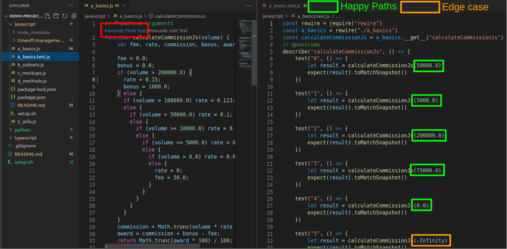
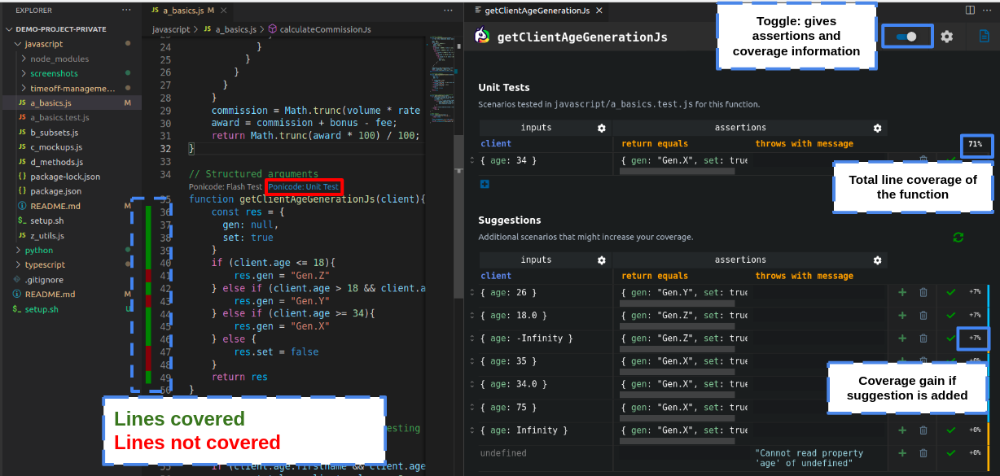
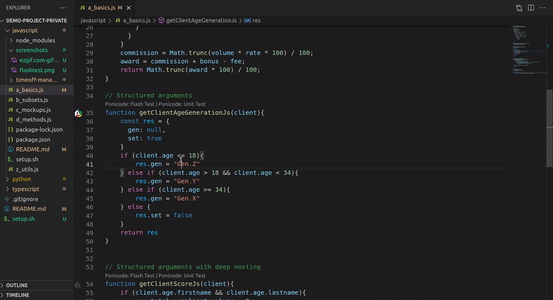
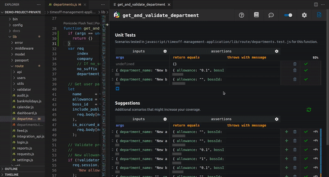
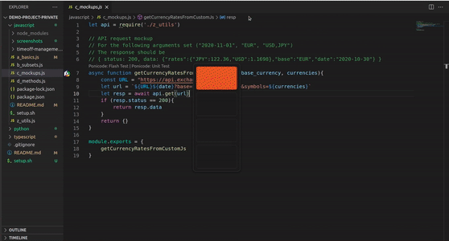

# Introduction
You are about to follow a <ins> **3 minutes** </ins> end to end tutorial to show you <ins>**how to use Ponicode**</ins> to <ins>**detect bugs**</ins>, <ins>**prevent regressions**</ins>, increase your <ins>**code quality**</ins> and <ins>**coverage**</ins> by generating <ins>**unit tests**</ins>
All this tutorial is available on this video [HERE](https://ponicode.com)

# Setup Ponicode [Optional]
If you have not installed our extension do it for free in the [VSCode Marketplace](https://marketplace.visualstudio.com/items?itemName=ponicode.ponicode).

# Install dependencies
Ponicode uses a runner to verify that your tests pass. For this you should verify that needed packages are installed.
If not already done just enter this command in the `javascript` folder

```
cd path/to/demo-project/javascript
bash setup.sh
```

# Use cases
## Generate boilerplating test with Ponicode Flash Test

- Open the [a_basics.js file](./a_basics.js)
- Click in the body of the function `calculateCommissionJs`
- You should see two decorators appearing above your function `Ponicode:Flash Test` and `Ponicode:Unit test`
- Click on `Ponicode:Flash Test`
- Et voilà! You should see 5 to 6 test cases generated including <ins>**happy paths**</ins> and <ins>**edge cases**</ins>
- Flash test takes care of the most tedious part of testing: Syntax and testing multiple scenario



## Increase and visualize code coverage with Ponicode Unit test
- Open the [a_basics.js file](./a_basics.js)
- Click in the body of the function `getClientAgeGenerationJs`
- You should see two decorators appearing above your function `Ponicode:Flash Test` and `Ponicode:Unit test`
- Click on `Ponicode:Unit test`
- An interface will open on the right with two sections `Unit tests` and `Suggestions`. Section `Unit tests` represents all your existing test cases. Section `Suggestions` is a list of representations of test cases that Ponicode's AI engine thinks you should pick from to increase your code quality.
- You can click the <ins>**toggle**</ins> button next to the <ins>**settings**</ins> button to get asssertions on expected values and see coverage information
- The `Suggestions` are then filtered by coverage gain. You can see the red <ins>**bar next to the body of your function**</ins> becoming green as you click on the <ins>**+**</ins> for the different suggestions. Every green line represents a line covered by a test case of your `Unit tests` section. Each time you click on <ins>**+**</ins> for a suggestion, you are generating a test in your test file.
- The  <ins>**numbers**</ins> you see next to the **suggestions** represents how much line coverage gain for the functio is expected if you click on <ins>**+**</ins>. 
- The  <ins>**number**</ins> you see at the top right of the **unit test** section represents the total line coverage for your current function



## Prevent regressions and bugs with Ponicode Unit test
- Open the [departments.js file](./timeoff-management-application/lib/route/departments.js)
- Click in the body of the function `get_and_validate_department`
- You should see two decorators appearing above your function `Ponicode:Flash Test` and `Ponicode:Unit test`
- Click on `Ponicode:Unit test`
- An interface will open on the right with two sections `Unit tests` and `Suggestions`. Section `Unit tests` represents all your existing test cases. Section `Suggestions` is a list of representations of test cases that Ponicode's AI engine thinks you should pick from to increase your code quality.
- You can click the <ins>**toggle**</ins> button next to the <ins>**settings**</ins> button to get asssertions on expected values and see coverage information
### Bugs detection and correction
- The column `throws with message` is filled with a value for the input `undefined`. This is because Ponicode provides **edge cases** to see abnormal behavior. Here, a potential bug is detected. This is early bug detection.
- Let's say this early bug is actually a real bug. Just add a few lines of code so there is no throw message anymore.
- Add your test to protect you against a potential bug in the future


### Prevention detection
- Add a few `Suggestions`
- A regression is a function that is not behaving like it is suposed to anymore.
- Try to change the code, for example the return value in the body of the function. Ponicode will instantly tell you with a red <ins>**x**</ins> which test is now failing, pointing to a regression.
- Just change the value back to what it was and see the test passing again to correct that regression.



## Mocking with Ponicode Unit Test
- Open the [c_mockups.js file](./c_mockups.js)
- Click in the body of the function `getCurrencyRatesFromCustomJs`
- You should see two decorators appearing above your function `Ponicode:Flash Test` and `Ponicode:Unit test`
- Click on `Ponicode:Unit test`
- An interface will open on the right with two sections `Unit tests` and `Suggestions`. Section `Unit tests` represents all your existing test cases. Section `Suggestions` is a list of representations of test cases that Ponicode's AI engine thinks you should pick from to increase your code quality.
- Click right on the method `.get`
- Click on `Ponicode Mock`
- Two new columns with appear `z_utils.getcalledWith` to spy and `z_utils.getreturns` to stub
- Copy and paste the value below in the `z_utils.getreturns` column for the first suggestion
```
{ status: 200, data: {"rates":{"JPY":122.36,"USD":1.1698},"base":"EUR","date":"2020-10-30"} }
```
- Copy and paste the value below in the `z_utils.getreturns` column for the first suggestion
- Click on <ins>**+**</ins> to add the test case and click on the <ins>**file icon**</ins> at the top right of the interface to open the test file
